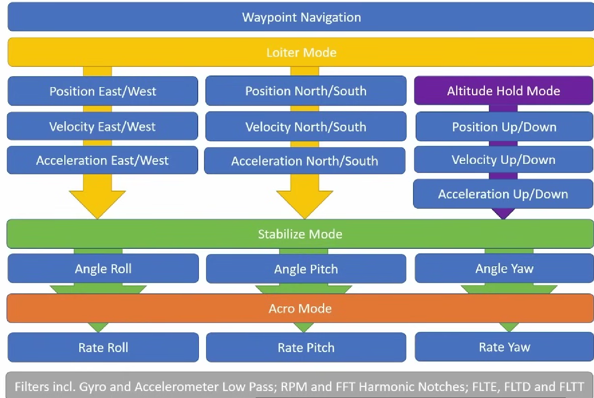

## 🚁 一、系统概述：控制层级架构

### 1.1 控制层级基本原理
无人机控制系统采用**自下而上**的层级设计，每一层建立在下层基础上，如同建造房屋：
- **地基层**：传感器数据滤波与处理
- **框架层**：姿态角速度控制 (Rate Mode)
- **墙体层**：姿态角度控制 (Stabilize Mode)
- **功能层**：位置与高度控制
- **智能层**：高级导航 (Loiter & Waypoint)

> 💡 **关键理念**：**"先调稳底层，再优化上层"**。没有稳定的底层，上层功能无法正常工作。

### 1.2 RG Pilot Lo-TEL 系统架构

- **最底层**：Rate Mode (Acro Mode) - 橙色
- **第二层**：Stabilize Mode - 绿色
- **第三层**：Position & Altitude Control - 蓝色+紫色
- **最顶层**：Loiter Mode & Waypoint Navigation - 黄色+蓝色
- **基础支撑**：各种滤波器系统 (底部注释)

## 🔧 二、首次设置与调校路线图

### 2.1 调校顺序与逻辑
根据视频内容，完整调校流程遵循**从底层到高层**原则：

1. **滤波器调校** (最基础)
   - 陀螺仪(Gyro)和加速度计(Accelerometer)低通滤波
   - RPM和FFT谐波陷波滤波
   - PID误差、微分和目标滤波

2. **Rate控制器调校** (基础飞行性能)
   - 滚转(Roll)、俯仰(Pitch)、偏航(Yaw)轴的PID参数

3. **Stabilize姿态调校** (稳定飞行)
   - 角度控制器的PID参数
   - 确保无人机能精确保持倾斜角度

4. **高级功能调校**
   - 高度保持(Altitude Hold)调校
     - 垂直位置、速度、加速度控制器
   - 悬停(Loiter)模式调校
     - 水平位置、速度、加速度控制器
   - Loiter模式和航点导航行为参数

### 2.2 调校前必备检查
- ✅ 确保螺旋桨安装正确，无明显变形
- ✅ 电机转向验证
- ✅ 遥控器通道映射正确
- ✅ 姿态传感器校准完成
- ✅ GPS信号良好(至少6颗卫星)
- ✅ 电池电量充足(避免低电量影响性能)

## 🧰 三、详细调校步骤与原理

### 3.1 滤波器调校 (基础层)
**为什么重要**：滤波器是整个系统的"感官过滤器"，决定无人机"看到"的世界是否准确。

#### 3.1.1 陀螺仪与加速度计低通滤波
- **作用**：过滤高频振动，保留有用的姿态变化信号
- **调校方法**：
  1. 在地面录制飞行日志
  2. 分析频谱，找到噪声峰值
  3. 设置截止频率略高于飞行振动频率
- **小白理解**：像戴降噪耳机，只听清楚指令，忽略背景噪音

#### 3.1.2 RPM和FFT谐波陷波滤波
- **作用**：精准过滤电机转动产生的特定频率振动
- **调校关键**：
  - 需要连接RPM信号或通过FFT自动检测
  - 陷波宽度要足够窄，只过滤问题频率
- **原理**：电机每分钟转速(RPM)会产生特定谐波频率，当与机身固有频率共振时会导致失控

#### 3.1.3 PID滤波器 (FLTE, FLTD, FLTT)
- **FLTE**：东西方向(East/West)滤波
- **FLTD**：南北方向(North/South)滤波 
- **FLTT**：油门/高度(Throttle)方向滤波
- **调校技巧**：先设为保守值(如10Hz)，测试后再逐步提高以获得更好响应

### 3.2 Rate控制器调校 (飞行手感)
**核心目标**：让无人机对摇杆输入有精准、平滑的响应，无振荡。

#### 3.2.1 P(比例)参数
- **作用**：决定无人机对错误的反应强度
- **调校方法**：
  1. 从低值开始(如0.1)
  2. 逐步增加直到有轻微振荡
  3. 降低10%作为最终值
- **飞行测试**：在Acro模式下做轻微翻滚，观察是否平滑

#### 3.2.2 D(微分)参数
- **作用**：抑制振荡，提供"阻尼"效果
- **关键点**：太低→振荡；太高→响应迟钝
- **调校技巧**：先调好P，再调D，通常D值约为P值的1/4

#### 3.2.3 I(积分)参数
- **作用**：消除长期累积误差
- **在Rate模式**：通常设为较低值，避免积分饱和

> 🛠️ **专业技巧**：Rate调校最好在无风环境进行，使用飞行分析软件查看响应曲线。

### 3.3 Stabilize姿态调校 (稳定飞行)
**核心目标**：让无人机精确保持指定角度，松杆自动回平。

#### 3.3.1 角度控制器调校
- **P参数**：控制角度保持强度
  - 太低→角度保持不稳
  - 太高→在目标角度振荡
- **I参数**：消除角度漂移
  - 关键用于抵抗持续风力
  - 太高会导致缓慢振荡

#### 3.3.2 测试方法
1. **静态测试**：悬停，观察姿态角波动
2. **动态测试**：倾斜30度保持，观察是否稳定
3. **恢复测试**：松开摇杆，观察回平速度和稳定性

### 3.4 高级功能调校 (智能飞行)

#### 3.4.1 高度保持调校
- **三个层次**：
  1. 垂直加速度控制 (最底层)
  2. 垂直速度控制 (中间层)
  3. 垂直位置控制 (最上层)
- **关键参数**：
  - PSC_ACCZ_P: 加速度控制器P值
  - PSC_VELZ_P: 速度控制器P值
  - PSC_POSZ_P: 位置控制器P值
- **测试方法**：设定高度，观察是否稳定，有无上下漂移

#### 3.4.2 Loiter模式调校
- **比高度保持更复杂**：需要同时控制三个维度
- **水平位置控制**：
  - PSC_POSXY_P: 水平位置P值
  - PSC_VELXY_P: 水平速度P值
- **常见问题**：
  - 位置抖动→提高滤波或降低P值
  - 位置漂移→提高P值或检查GPS质量
  - 风中不稳定→调整抗风参数

#### 3.4.3 航点导航优化
- **关键参数**：
  - WP_RADIUS: 航点接受半径
  - WP_SPEED: 航点间飞行速度
  - LOIT_SPEED: Loiter模式最大速度
- **调校重点**：
  - 航点切换平滑性
  - 转弯半径合理性
  - 风中路径跟踪精度

## 📚 四、专业术语详解（小白友好版）

### 4.1 基础姿态术语
| 术语 | 专业含义 | 小白理解 | 生活比喻 |
|------|----------|----------|----------|
| Roll (滚转) | 绕X轴旋转 | 无人机左右倾斜 | 倾斜手机像倒水 |
| Pitch (俯仰) | 绕Y轴旋转 | 无人机前后倾斜 | 点头说"是" |
| Yaw (偏航) | 绕Z轴旋转 | 无人机原地转向 | 摇头说"不" |
| Rate Mode | 角速度控制模式 | "纯手动"飞行模式 | 无辅助轮自行车 |
| Stabilize Mode | 角度稳定模式 | 自动保持水平 | 有训练轮自行车 |

### 4.2 传感器与滤波
| 术语 | 专业含义 | 小白理解 | 重要性 |
|------|----------|----------|----------|
| Gyro (陀螺仪) | 测量旋转速度 | 无人机的"内耳" | 感知旋转，基础姿态 |
| Accelerometer (加速度计) | 测量线性加速度 | 无人机的"肌肉感觉" | 感知运动，重力方向 |
| Low Pass Filter | 允许低频信号通过 | "降噪耳机" | 消除电机震动干扰 |
| Harmonic Notch | 过滤特定频率 | "抗共振盾牌" | 防止特定频率共振 |
| FFT (快速傅里叶变换) | 将信号分解为频率 | "声谱分析仪" | 识别问题频率 |

### 4.3 控制理论术语
| 术语 | 专业含义 | 小白理解 | 调校提示 |
|------|----------|----------|----------|
| P (比例) | 根据误差大小调整输出 | "现在有多错" | 太高→振荡；太低→反应慢 |
| I (积分) | 累计历史误差 | "一直没纠正的错" | 防止长期漂移，但易过调 |
| D (微分) | 预测未来误差变化 | "错误变化的速度" | 抑制振荡，增加稳定性 |
| FLTE/FLTD/FLTT | 不同方向滤波参数 | "方向性降噪" | 东西/南北/高度方向独立调整 |

## 🔍 五、调校实践技巧与问题排查

### 5.1 常见问题与解决方案
| 问题现象 | 可能原因 | 解决方案 |
|----------|----------|----------|
| 飞行抖动 | 滤波不足，P值过高 | 降低P值，增强滤波 |
| 响应迟钝 | 滤波过度，P值过低 | 降低滤波强度，提高P值 |
| 悬停漂移 | 传感器校准问题，I值过低 | 重新校准传感器，提高I值 |
| 高度波动 | 气压计干扰，垂直控制不佳 | 检查滤波，调整高度控制器 |
| 航点偏离 | GPS质量差，位置P值低 | 检查卫星数，提高P值 |

### 5.2 高效调校流程
1. **每次只调一个参数**：避免多个变量干扰判断
2. **小步调整**：每次变化不超过10%
3. **记录每次修改**：建立调校日志，方便回溯
4. **多环境测试**：无风、微风、有风环境分别测试
5. **分析飞行日志**：不只靠感觉，用数据说话

### 5.3 安全第一原则
- 🚨 **室内调校仅限于**：滤波器设置、遥控器校准
- 🚨 **Rate模式调校**：在开阔无障区域，高度不超过1米
- 🚨 **每次重大参数修改后**：先悬停测试，再做机动
- 🚨 **始终准备**：切换到稳定模式或紧急降落

## 💎 六、核心要点总结

1. **层级思维**：无人机控制是层层叠加的系统，底层决定上层极限
2. **滤波优先**：80%的飞行问题源于传感器噪声，先解决"看不清"的问题
3. **循序渐进**：从Rate到Stabilize再到Position，不要跳步
4. **数据驱动**：不要只依赖感觉，学会阅读飞行日志
5. **安全边界**：每次重大修改后，先在低风险环境测试

> ✨ **终极目标**：让无人机既像猎豹一样敏捷，又像老鹰一样稳定。完美的调校是艺术与科学的结合，需要耐心和经验积累。

---

**附录**：推荐工具与资源
- **地面站软件**：Mission Planner, QGroundControl
- **日志分析**：Flight Review, ArduPilot WebTools
- **调校社区**：ArduPilot论坛，RCGroups相关板块
- **理论学习**：控制理论基础，傅里叶变换入门

这份笔记融合了视频内容和系统控制理论，无论你是刚接触无人机的小白，还是希望深入理解调校原理的爱好者，都能找到适合自己的学习路径。记住：每一个专业调校师都是从第一次起飞开始的！✈️